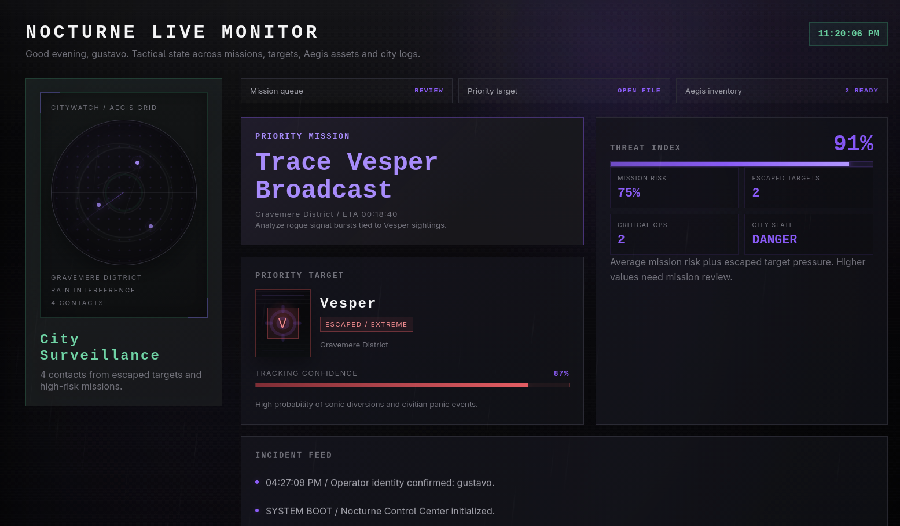
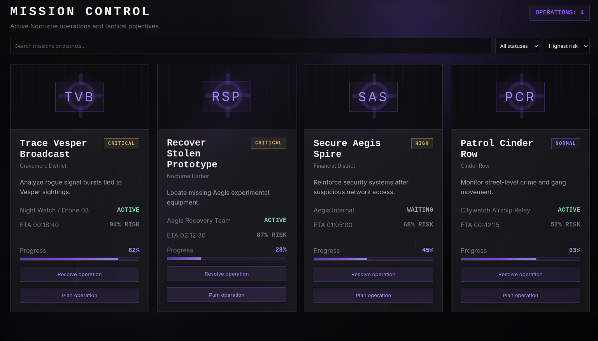
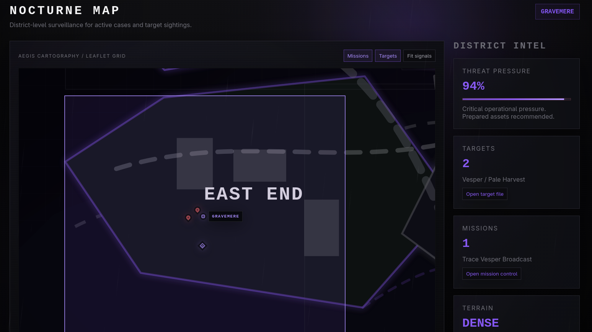
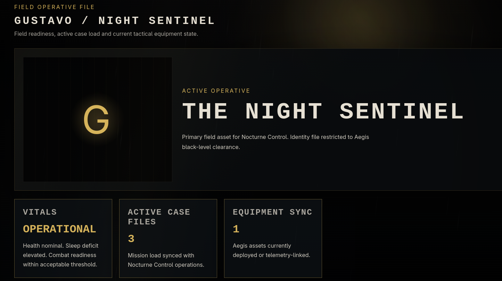
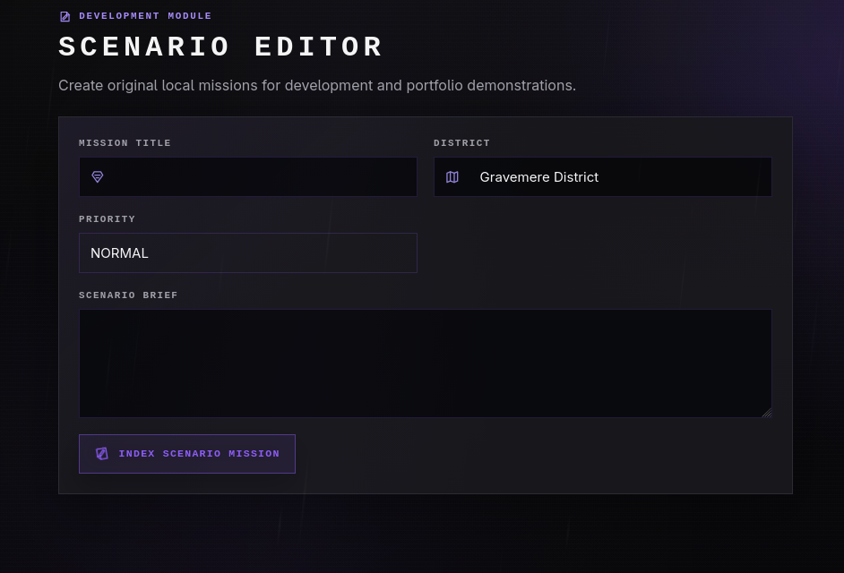

# Nocturne Control Center

<p align="center">
  <strong>A local-first noir tactical simulation for a city that never sleeps.</strong>
</p>

<p align="center">
  <a href="https://gustavomfg.github.io/nocturne-control/">Live demo</a>
  ·
  <a href="#interface-tour">Interface tour</a>
  ·
  <a href="#getting-started">Run locally</a>
</p>

<p align="center">
  
  
  
  
</p>



<p align="center"><em>The live monitor brings mission pressure, escaped targets, Aegis readiness and city signals into one operational view.</em></p>

---

Nocturne Control Center is a fictional city operations console for Nocturne City. It combines a live dashboard, mission planning, target files, Aegis equipment, a local SVG district map, campaign progression, logs, profile state and an interactive terminal into one connected simulation.

All names, districts, dossiers, missions, gadgets and map artwork are original fictional material. The app does not use external map APIs, backend services or private API keys.

## Highlights

- Connected local simulation for missions, villains, gadgets, logs and operator identity.
- Night Watch campaign loop with tactical plans, three-turn watches, city stability, intelligence, achievements and an operational replay.
- Strategy-aware planning forecasts and after-action watch reports with progress, risk, intelligence and asset power consequences.
- Mission planner with field-unit assignment, selectable operational protocols and deployable Aegis assets.
- Local Scenario Editor for adding original mission briefs to the current simulation.
- Tactical dashboard with radar, priority mission, priority target, incident feed and threat breakdown.
- Leaflet-powered custom city map using `CRS.Simple`, a local SVG overlay and custom mission, target and district signals.
- District intel panel, keyboard-accessible signal summary and direct links into missions or target files.
- Mission, villain and gadget collections with search, filters, empty states and responsive cards.
- Sentinel Terminal with commands backed by the same application state.
- Persistent operator onboarding, editable profile, validated JSON import/export (1 MB maximum) and reset flow.
- Global command palette with `Ctrl/Cmd + K`, search, arrow-key navigation and Enter selection.
- Optional interface effects, sound toggle, high-contrast mode and reduced-motion support.
- Responsive sidebar/drawer navigation for desktop and mobile.
- Toast feedback, confirmation dialogs, route skeletons and typed reducer tests.
- Installable local-first PWA with an offline service worker.

## Interface Tour

The screenshots below show the current violet operational interface and its connected simulation state.

### Mission Control



Mission Control is the tactical queue for every operation in Nocturne City. Operators can search and filter cases, compare risk and progress, resolve objectives, or prepare a plan with a field unit, protocol and deployable assets. Strategies produce different consequences, while recommended equipment adds operational synergy.

### District Surveillance



The map uses Leaflet with a completely local SVG city grid—no external tiles or map API. Mission signals, escaped targets and selectable districts are connected to the same simulation state, while the intelligence rail summarizes threat pressure and provides direct routes to relevant files.

### Operator Profile



The operator file reflects the current simulation: active case load, deployed equipment and identity are derived from persistent application state. The operator name can be edited without resetting campaign progress and is preserved through operational resets.

### Scenario Editor



The local editor creates original mission briefs without a backend. New scenarios enter Mission Control as waiting operations, become part of the campaign loop and appear as live map signals after the watch advances.

## How the Simulation Connects

```text
Plan mission ──► Select protocol and assets ──► Advance watch
      │                                             │
      └── Mission Control                    After-action report
                                                    │
                         Map ◄── Shared state ──► Logs / Dashboard
```

Actions are not isolated to one screen. Capturing a target changes related mission pressure; deploying an asset consumes power; planning modifies the next watch; and every consequence is reflected across reports, logs, map signals and dashboard metrics.

## Tech Stack

- React 19
- TypeScript
- Vite
- Leaflet
- ESLint
- Vitest
- Playwright
- Testing Library
- CSS organized by page/component

The application deliberately keeps its runtime small: there is no backend, authentication provider, external map service or component framework.

## Getting Started

```bash
npm ci
npm run dev
```

The development server uses the Vite base path configured for the GitHub Pages repository:

```text
/nocturne-control/
```

For another deployment path, set `VITE_BASE_PATH` before building.

Use `npm install` only when intentionally changing dependencies. For normal development and CI, `npm ci` installs the exact dependency tree from `package-lock.json`.

## Scripts

```bash
npm run dev       # start local Vite server
npm run lint      # run ESLint
npm run test      # run Vitest tests once
npm run build     # typecheck and build production assets
npm run test:pwa  # build and run the PWA smoke test in Chromium
npm run preview   # preview the production build
```

## Quality Checks

Before pushing changes, run:

```bash
npm run lint
npm run test
npm run test:pwa
```

The suite includes 26 Vitest checks plus a Playwright browser smoke test. It covers state migration and validation, operator identity preservation, connected navigation and mission actions, strategy consequences, campaign turns, achievement logs, watch reports, accessible map filters, dialogs, save import, deep links and first-install offline behavior.

## App Routes

| Route | Purpose |
| --- | --- |
| `/dashboard` | Tactical overview, threat breakdown and priority signals |
| `/gravemere` | Villain archive and target dossiers |
| `/missions` | Mission queue, status filters and resolve actions |
| `/aegis` | Gadget inventory and deployment controls |
| `/terminal` | Command-line interface into the app state |
| `/map` | Local Leaflet district map and signal intel |
| `/campaign` | Night Watch campaign, forecasts, after-action reports and replay |
| `/editor` | Local development tool for original scenario missions |
| `/profile` | Operator profile and save import/export |
| `/logs` | Operational event history |

## Terminal Commands

Inside the app terminal, try:

```text
help
status city
list villains
list missions
list gadgets
open vesper
open night rover
deploy linecaster
capture vesper
resolve vesper
scan gravemere
signal on
whoami
go map
go campaign
go editor
reset state
clear
```

## Map System

The map uses Leaflet with a simple coordinate system and a local SVG overlay:

```text
public/maps/nocturne-custom-map.svg
```

There is no Google Maps, Mapbox, tile server or external cartography dependency. District selection uses local bounds and custom Leaflet marker markup from `src/pages/NocturneMap.tsx` and `src/components/LeafletNocturneMap.tsx`.

## Campaign and Local Scenarios

Use **Plan operation** in Mission Control to assign a unit, protocol and assets. The planner previews progress, risk, intelligence, power cost and equipment synergy before the plan is committed. Then use **Advance watch** in Night Watch to simulate the next turn and inspect its after-action report.

`STEALTH` reduces exposure, `DIRECT` favors fast progress, and `SURVEILLANCE` produces stronger intelligence. Recommended gadgets improve the operation but consume power during the watch.

The Scenario Editor adds a local mission to the persistent simulation. New scenarios begin as waiting operations and become visible as active map signals when the campaign advances.

## Offline and Deep Links

The production build injects its versioned asset list into the service worker. The first successful installation pre-caches the application shell, route chunks, styles, manifest, icons and local map so a later launch can initialize offline. Hashed static assets use cache-first delivery, while navigations try the network before falling back to the cached shell.

GitHub Pages deep links are supported through `public/404.html`, which restores an internal route such as `/gravemere/vesper` after a direct visit or refresh.

## Project Structure

```text
public           Custom map, PWA manifest, service worker and Pages fallback
images           Curated screenshots used by this README
tests            Playwright browser and offline smoke tests
src/components  Shared UI components
src/data        Static fictional domain data
src/domain      Pure mission forecasting rules
src/hooks       UI interaction hooks
src/pages       Main app screens
src/state       Reducer, context, persistence and tests
src/styles      Global, page and component CSS
src/types       Domain TypeScript models
src/utils       Asset, audio, slug and UI event helpers
```

Additional project context lives in:

```text
DESIGN.md       Visual system, interaction rules and UI constraints
PRODUCT.md      Product purpose, audience and design principles
```

## Deployment

Pushes to `main` run `.github/workflows/deploy.yml`.

The workflow installs dependencies, runs lint and Vitest, installs Chromium, builds the production app, runs the Playwright PWA smoke test, uploads `dist/` and deploys to GitHub Pages.

## Git Hygiene

The repository ignores:

- dependency and build output (`node_modules/`, `dist/`)
- local env files while keeping `.env.example`
- coverage, reports, generated test screenshots and cache folders
- local agent/session metadata (`.agents/`, `.codex/`)
- private key/certificate formats
- local raster asset folders that are not cleared for repository use

The curated screenshots in `images/` are intentionally tracked as project documentation. Raw capture folders such as a repository-local `Imagens/` remain ignored; capture folders outside the repository are never considered by Git. Keep other committed assets original, lightweight and cleared for public use.

## License / Usage

Nocturne Control Center is an original fictional portfolio/study project. Do not add real agencies, real dossiers, real people, real brands, real maps or recognizable franchise material.
