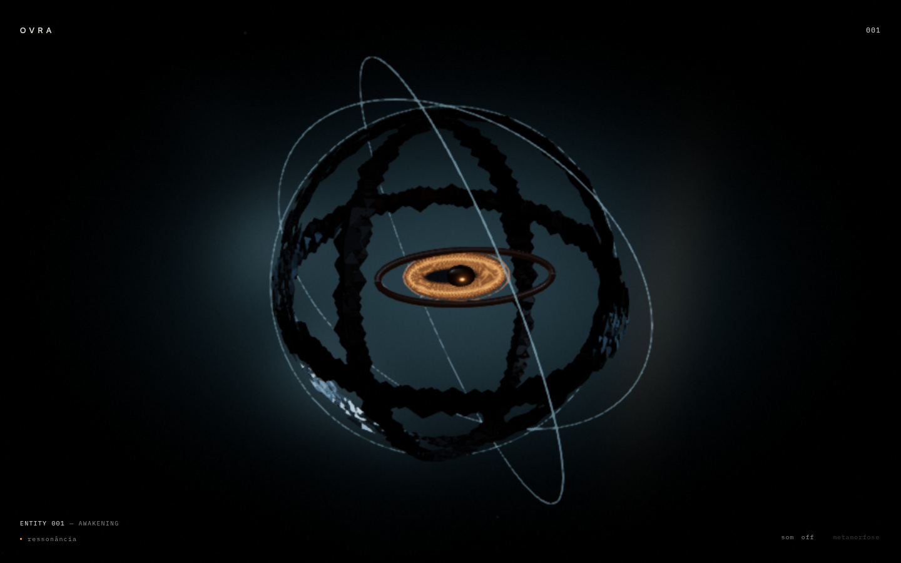

# OVRA

> **Status: laboratório pessoal em evolução.** OVRA é um espaço para experimentos independentes de creative development: arte generativa, animações cinematográficas, WebGL, Three.js e interações experimentais. Não é um site institucional, um portfólio nem um produto.

<p align="center">
  <a href="https://gustavomfg.github.io/ovra/">Experiência publicada</a>
  ·
  <a href="#executar-localmente">Executar localmente</a>
  ·
  <a href="DESIGN.md">Sistema visual</a>
  ·
  <a href="docs/entity-001.md">ENTITY 001 — AWAKENING</a>
</p>

<p align="center">
  
  
  
  
  
</p>

<p align="center">
  
</p>

## Experimentos

| Código | Nome | Ideia |
| --- | --- | --- |
| 001 | [ENTITY 001 — AWAKENING](docs/entity-001.md) | Uma cápsula mecânica que desperta, observa com atraso e responde com sete temperamentos. A ressonância abre suavemente as placas, modula a luz e mantém a entidade montada. |

Uma performance audiovisual feita com código: a abertura de 11,8 s revela contorno, matéria e olhar. Aproxime o cursor devagar e permaneça para despertar curiosidade; movimentos rápidos acumulam tensão; o toque produz um pulso discreto de luz. Segure perto da entidade por 1,25 s, dê um duplo toque ou use o botão `metamorfose` para iniciar a ressonância contida de 8,8 s. O som é opcional e começa no botão `som`.

<details>
  <summary>AWAKENING durante a ressonância</summary>
  <p align="center">
    
  </p>
</details>

Cada experimento é uma pasta independente em `src/experiments/`. A lista fica em `src/experiments/registry.ts` e é carregada sob demanda: um experimento só é baixado quando aberto.

## Executar localmente

```bash
npm ci
npm run dev
```

O servidor de desenvolvimento usa o caminho de publicação do GitHub Pages:

```text
/ovra/
```

Para outro caminho de publicação, defina `VITE_BASE_PATH` antes de compilar.

## Scripts

```bash
npm run dev       # servidor de desenvolvimento
npm run lint      # ESLint
npm run test      # testes unitários e de componentes (Vitest)
npm run build     # verificação de tipos e build de produção
npm run test:pwa  # build e teste do PWA no Chromium (Playwright)
npm run preview   # serve o build de produção
```

## Arquitetura

```text
src/
  main.tsx                    inicialização e registro do service worker
  app/                        shell: cabeçalho discreto, roteamento por hash e cortina entre experimentos
  core/                       base reutilizável para qualquer experimento
    camera.ts                 câmera orbital com movimento amortecido e objetivos tweenáveis
    lighting.ts               ambiente HDR procedural (softboxes) para reflexos de metal
    postprocessing.ts         bloom, antialiasing e acabamento (vinheta, grão, lente, ondulação)
    frameLoop.ts              tempo da cena e passo físico; pausa com a aba oculta ou fora da tela
    assets.ts                 carregamento de GLTF/GLB com cache e descarte de recursos
    audio.ts                  ambiência opcional em Web Audio, desligada por padrão
    spring.ts, math.ts, noise.ts, transitions.ts, capabilities.ts
  experiments/
    registry.ts               lista de experimentos (carregamento preguiçoso)
    entity-001/               AWAKENING: modelo Blender, temperamento, percepção, performance e fallback
public/3d/entity-001/          modelos Blender cinematic e optimized
public/                       manifesto, service worker, ícone e página 404 do GitHub Pages
tests/                        teste de offline do PWA e teste de navegador
docs/entity-001.md            direção artística e especificação de comportamento
```

### Como criar um experimento

1. Crie `src/experiments/<nome>/` com um componente padrão exportado (o componente é o ponto de entrada).
2. Use `core/` para câmera, luz, pós-processamento, loop e recursos. Mantenha a lógica do experimento dentro da pasta.
3. Registre em `src/experiments/registry.ts` com um `slug` (usado em `#/slug`), um `code` curto e o `lazy(() => import(...))`.
4. Escreva testes para a lógica pura (sem WebGL) e um teste de montagem com `getContext` simulado, como em `Entity001.test.tsx`.

### Modelos 3D

AWAKENING usa os modelos Blender existentes em `public/3d/entity-001/`, com versões cinematic e optimized. A forma e os materiais de origem são preservados; a animação web atua sobre seus controles. Se o modelo falhar, uma cápsula procedural mantém a experiência. Para um experimento com modelo pronto, exporte um GLB/GLTF pelo Blender e carregue com `loadGltf` (`src/core/assets.ts`), que já faz cache e tenta de novo após uma falha. Siga o exemplo de propriedade de recursos em `Character`: cada montagem possui geometrias e materiais próprios, e o cache compartilhado não é descartado.

## Qualidade e acessibilidade

- **Movimento reduzido**: a entidade aparece assentada, sem intro, deriva, olhar seguindo o cursor ou movimento de câmera. Ativar a preferência durante uma sequência interrompe o movimento. A metamorfose vira um pulso suave de luz.
- **Sem WebGL2**: o modo essencial desenha uma máscara procedural em canvas 2D e compartilha temperamento, percepção, relógio da performance e controles. Também assume a cena após uma perda de contexto WebGL.
- **Recursos**: o render e o tempo narrativo param com a aba oculta, fora da tela ou com a área da cena zerada. Recursos da cena, pós-processamento, ambiente HDR e contexto WebGL são liberados ao desmontar; a resolução pode baixar em passos pequenos quando uma janela de quadros confirma lentidão.
- **Áudio**: silencioso por padrão e só começa após ação explícita.
- **Teclado**: os controles são botões nativos com foco visível; `metamorfose` oferece a mesma ação do gesto de segurar ou do duplo toque. O estado é anunciado sem interromper a leitura.
- **Publicação**: GitHub Pages em [`/ovra/`](https://gustavomfg.github.io/ovra/). `VITE_BASE_PATH` e `base` em `vite.config.ts` usam o caminho atual do repositório.

## Publicação

Pushes para `main` executam `.github/workflows/deploy.yml`: lint, testes, build, teste do PWA no Chromium e publicação de `dist/` no GitHub Pages.

## Licença e uso

Projeto pessoal de experimentação. Todo o código e as formas são originais. Mantenha os experimentos fiéis à ideia central: o visitante descobre o comportamento pela curiosidade, sem precisar ler explicações.
