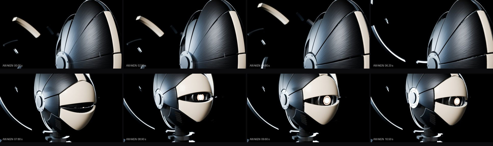
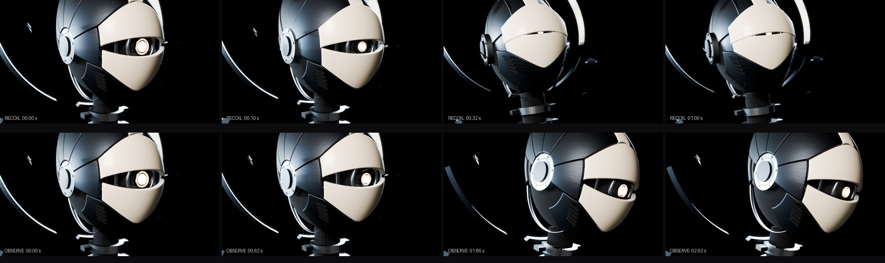
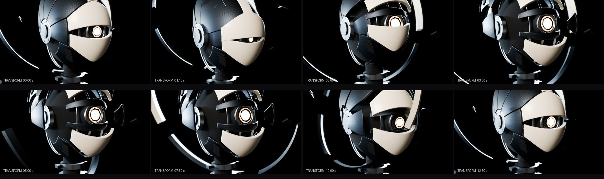
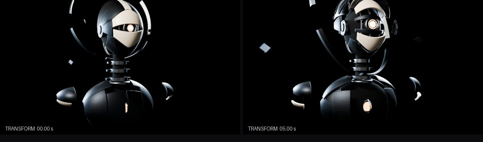

# ENTITY 001 — AWAKENING · Guia de animação

Cinco clipes autorais, exportados como animações glTF nomeadas. Todos foram feitos à mão em chaves Bézier com alças *auto-clamped* (ease in/out sem estourar). Exceções: os giroscópios usam chaves lineares para girar em velocidade constante, e o movimento secundário dos flutuantes é amostrado de senoides.

| Clipe | Duração | Loop | Papel na obra |
| --- | --- | --- | --- |
| `AWAKEN` | 11,8 s | não | Abertura; mesma duração da abertura web |
| `IDLE` | 8,0 s | sim (quadro inicial = final) | Presença contínua |
| `OBSERVE` | 4,5 s | não, termina em repouso | Curiosidade |
| `RECOIL` | 3,2 s | não, termina em repouso | Susto e proteção |
| `TRANSFORM` | 12,6 s | não, termina em repouso | Ressonância; mesmas marcas da sequência web |

## Princípios aplicados

- **Sobreposição e follow-through**: um gesto de cabeça é distribuído nas três vértebras e na cabeça (18/24/26/32 %), cada uma 0,06–0,12 s depois da anterior. A base começa e o crânio termina.
- **Antecipação**: antes de erguer a cabeça (AWAKEN 5,6 s), antes de inclinar (OBSERVE 0,62 s) e antes de recuar (RECOIL 0,1 s), há um pequeno movimento contrário.
- **O olho conduz**: em IDLE e OBSERVE o olho faz uma sacada rápida (3–4 quadros) e a cabeça segue depois, com menos amplitude.
- **Overshoot com assentamento**: as placas "estalam" além do repouso antes de assentar (AWAKEN e o fechamento da TRANSFORM).
- **Pausas como atuação**: chaves de espera mantêm poses (respiração com pausa, a inclinação curiosa sustentada, o susto que treme e decai).

## Clipes

### AWAKEN — 11,8 s

| Tempo | Ação |
| --- | --- |
| 0–1,4 | Pose recolhida: queixo no peito, pálpebras fechadas, placas apertadas, halo afundado atrás das costas, ombros curvados. Imobilidade. |
| 0,9 | Primeiro sinal de vida: um fragmento estremece. |
| 1,4–4,4 | Os giroscópios do peito partem devagar e estabilizam. |
| 2,6–4,8 | As placas se soltam uma a uma, da nuca até a máscara, como uma onda. |
| 4,2–7,0 | O halo sobe e cada arco encontra seu lugar com atraso. |
| 5,6–9,2 | A cabeça afunda um pouco mais (antecipação) e é erguida pelo pescoço, base primeiro, com overshoot para cima. |
| 7,6–9,4 | As pálpebras se entreabrem, hesitam e se abrem de uma vez; a pupila dilata. |
| 9,6–11,8 | Percebe algo: o olho vai primeiro, a cabeça inclina, a pupila foca e tudo para, olhando à frente. |

### IDLE — 8 s, loop

- Duas respirações artificiais (inspira 1,4 s, segura 0,6 s, expira 1,6 s, pausa), com mandíbula e ombros acompanhando.
- Dois olhares laterais conduzidos por sacadas do olho.
- Uma piscada aos 3,6 s.
- Um ajuste de foco aos 4,6 s.
- Giroscópios em rotação contínua.
- Halo e fragmentos derivando em períodos que dividem o loop, para fechar sem emenda.

### OBSERVE — 4,5 s

Sacada do olho, recuo breve, depois inclinação (roll ≈ 0,24 rad) e leve aproximação, sempre **de frente para o visitante**. A pose é sustentada com pálpebras estreitadas, um segundo pulso de foco aos 2,5 s e o halo atrasado em relação à cabeça. Volta ao repouso.

### RECOIL — 3,2 s

Um leve avanço (0,1 s) e o estalo para trás (0,32 s): corpo recua, cabeça sobe e vira, ombros sobem e fecham para frente, placas se apertam, olho vira um fio, halo e fragmentos se recolhem. Um tremor amortecido segue até 1,4 s e a recuperação é lenta.

### TRANSFORM — 12,6 s

Marcas iguais às da ressonância web (`choreography.ts`):

| Marca web | Tempo | No modelo |
| --- | --- | --- |
| `anticipation` | 0–1,2 | Todo o corpo se contrai; olho estreito; halo se fecha. |
| `rupture` | 1,2–4,8 | As placas se abrem da crista para fora, uma a cada 0,09 s, com overshoot (1,12) e assentamento. O esterno se abre e revela o núcleo. O halo se expande (×1,4) e gira, os fragmentos se afastam e os giroscópios aceleram. |
| `threshold` | 3,8–7,0 | Matéria aberta flutuando levemente. Momento para a câmera web mergulhar. |
| `inside` | 7,0–8,4 | Quietude máxima. |
| `return` | 8,4–12,6 | As placas fecham em ordem inversa, com um estalo além do repouso. |

## Correspondência com o temperamento web

| Estado web | Sugestão |
| --- | --- |
| `dreaming` | `IDLE` com `timeScale` 0,6 e pálpebras meio fechadas por código (`LID_*`) |
| `observing` | `IDLE` + mira em tempo real (`CTRL_LOOK`, `CTRL_GAZE`) |
| `curious` | crossfade para `OBSERVE` (0,4 s) e de volta ao `IDLE` |
| `wary` | `RECOIL` com crossfade curto (0,12 s) |
| `alert`, `disturbed` | `RECOIL` com `timeScale` 1,2–1,4 e mira desviada |
| `ignoring` | `IDLE` + `ENTITY_ROOT` girado para longe no Y (o corpo todo se vira; o pescoço não foi feito para 180°) |
| ressonância | `TRANSFORM` com o mesmo playhead da linha do tempo web |

## Nós animados por clipe

Somente canais que se movem foram exportados. O `AnimationMixer` restaura a pose original dos nós que um clipe não toca. **Nenhum clipe anima** `ENTITY_ROOT`, `CTRL_LOOK` ou `CTRL_GAZE`, e o validador verifica isso.
