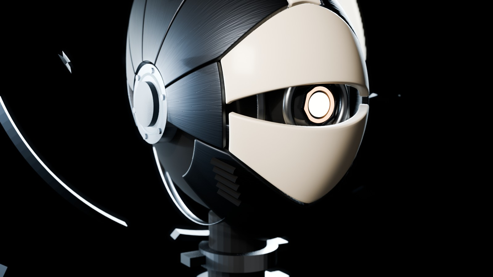

# ENTITY 001 — AWAKENING · Direção de arte

## Ideia

Uma vigia mecânica que acorda. Não tem boca nem expressão humana: toda a atuação passa por **um único olho** que corre atrás de uma fenda amendoada, por **pálpebras internas** e pela postura do pescoço. A estranheza vem dessa economia. Ela olha, e o resto do corpo obedece ao olhar.

## Regra central: o eixo de dobradiça

Todo o crânio é construído em torno de um eixo lateral que atravessa as têmporas, marcado por dois **cubos articulados** com um anel de sinal frio. Cada placa é um trecho de um elipsoide parametrizado em torno desse eixo, e por isso:

- as bordas das placas são curvas limpas, sem serrilhado de malha;
- girar uma placa no eixo X a faz deslizar sobre o crânio, como o visor de um capacete;
- pálpebras, mandíbula e a abertura da TRANSFORM usam o mesmo movimento. A mecânica tem uma lógica só.

Essa regra substitui posicionamentos aleatórios: a forma nasce do mecanismo.

## Anatomia

| Parte | Material | Função visual |
| --- | --- | --- |
| Máscara (`PLATE_BROW`, `PLATE_MUZZLE`) | Cerâmica técnica | O rosto. Um escudo com queixo em V, cortado pela fenda. A sobrancelha sobe e se continua na crista. |
| Crista (`PLATE_CREST_A/B`) | Cerâmica | Linha clara que atravessa o crânio da testa à nuca e define a silhueta de perfil. |
| Coroa, occipício, nuca, têmporas | Titânio escurecido | A massa do crânio, alongada e inclinada para trás. |
| Moldura traseira (`PLATE_REAR_FRAME_L/R`) | Titânio | Deixa uma janela que mostra costelas internas e um brilho âmbar. |
| Mandíbula (`PLATE_JAW`) | Titânio | Articulada no mesmo eixo, com respiros laterais em forma de guelra. |
| Cubos laterais | Metal escovado + anel frio | A dobradiça. Pequenos e embutidos, para não lerem como fones. |
| Olho (`CTRL_EYE` …) | Lente preta, lâminas da íris, pupila emissiva com anel âmbar | O ponto focal. Move-se atrás da fenda como um globo ocular. |
| Pescoço | Vértebras escovadas com aletas | Três segmentos articulados; distribuem os gestos da cabeça. |
| Peito | Titânio, núcleo âmbar, dois giroscópios | O esterno deixa uma fenda de luz; na TRANSFORM, ele se abre e revela o coração mecânico. |
| Halo quebrado | Cerâmica e titânio | Sete arcos com intervalos deliberados atrás da cabeça. Assinatura da silhueta. |
| Fragmentos | Titânio | Quatro lascas octaédricas, as mesmas peças do protótipo procedural no WebGL. |

## Paleta e materiais

Todos os materiais são Principled BSDF convertidos para glTF PBR. Não há nós procedurais exclusivos do Blender no modelo exportado.

| Material | Cor base | Metálico / rugosidade | Notas |
| --- | --- | --- | --- |
| `M_Titanium` | `#23272d` | 1 / 0,46 | Normal map escovado (micro-detalhe) |
| `M_Ceramic` | `#c4baa8` | 0 / 0,52 | Clearcoat 0,25 (`KHR_materials_clearcoat`) |
| `M_Brushed` | `#7d838b` | 1 / 0,30 | Normal map escovado; sem anisotropia, ver o guia de integração |
| `M_Inner` | `#08090b` | 0 / 0,90 | Especular reduzido (`KHR_materials_specular`), para o interior absorver luz |
| `M_Lens` | `#050608` | 0 / 0,04 | Preto brilhante atrás da íris |
| `M_SensorGlow` | emissão `#f3dfbd` × 14 | — | Pupila |
| `M_CoreEmber` | emissão `#ed9b56` × 7 | — | Anel da pupila, núcleo do peito, brilho interno do crânio |
| `M_FrostSignal` | emissão `#93b8cb` × 3 | — | Anéis dos cubos |

A paleta segue a do web (`config.ts`): grafite frio, âmbar como único calor, gelo como contraponto e marfim na cerâmica.

## Luz dos previews

Os previews foram renderizados no Eevee, **sem bloom e sem pós-processamento**:

- key quente-neutra alta à esquerda;
- dois rims frios atrás, que mantêm a silhueta mesmo na sombra;
- fill quase nulo;
- fundo no vazio do OVRA (`#030304`);
- profundidade de campo focada na pupila.

O mesmo modelo foi conferido no Three.js 0.186 com apenas duas luzes direcionais e um ambiente fraco, e continua legível.

| Vista | Arquivo |
| --- | --- |
| Três quartos | `previews/hero.jpg` |
| Frente | `previews/front.jpg` |
| Perfil (silhueta) | `previews/profile.jpg` |
| Traseira (janela interna) | `previews/rear.jpg` |
| Close do olho | `previews/eye.jpg` |
| Busto | `previews/bust.jpg` |

## Autoavaliação

- **Silhueta**: reconhecível de frente (escudo, fenda, halo) e de perfil (crânio inclinado, crista, dobradiça).
- **Identidade**: a combinação de máscara cerâmica, olho único que corre na fenda e halo quebrado é própria. Evitei as referências óbvias: boca, rosto humanoide, olhos vermelhos.
- **Olho**: é o ponto mais forte. Lâminas, anel âmbar e pupila leem até em miniatura.
- **Ponto fraco**: o tronco ainda é volumétrico e simples (ombreiras arredondadas). Para planos de cabeça e busto alto ele basta; para planos abertos precisa de um segundo passe.
